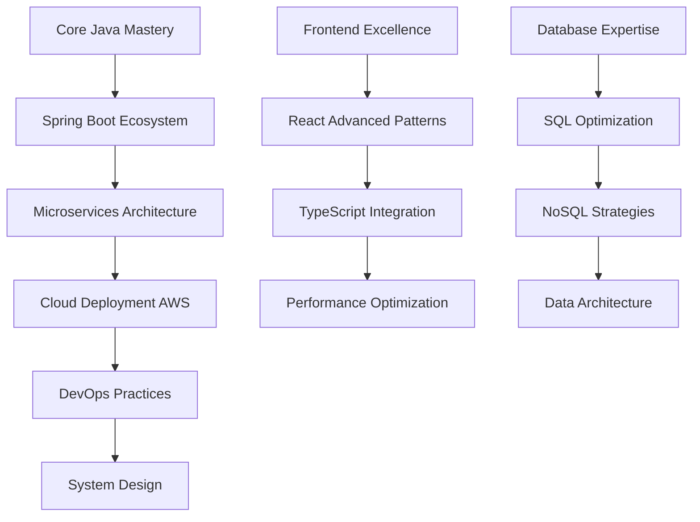

# 👋 Hello, I'm Shachiru

<div align="center">
  
[](https://git.io/typing-svg)

</div>

<div align="center">
  
</div>

---

## 🎯 **About Me**

```typescript
interface Developer {
  name: string;
  role: string;
  location: string;
  education: string;
  goal: string;
  technologies: {
    backend: string[];
    frontend: string[];
    database: string[];
    cloud: string[];
    tools: string[];
  };
  architecture: string[];
  currentFocus: string;
  philosophy: string;
}

const shachiru: Developer = {
  name: "Shachiru",
  role: "Software Engineering Student",
  location: "Sri Lanka 🇱🇰",
  education: "Institute of Java Software Engineer",
  goal: "Seeking software engineering internship opportunities",
  technologies: {
    backend: ["Java", "Spring Boot", "Node.js", "REST APIs"],
    frontend: ["React", "JavaScript", "HTML5", "CSS3", "Bootstrap", "Tailwind CSS"],
    database: ["MySQL", "PostgreSQL", "MongoDB"],
    cloud: ["AWS", "Docker"],
    tools: ["Git", "GitHub", "Maven", "IntelliJ IDEA"]
  },
  architecture: ["Microservices", "Cloud-Native", "RESTful Design"],
  currentFocus: "Building scalable enterprise applications with Java & Spring",
  philosophy: "Clean Code > Clever Code 🎯"
};
```

---

## 🚀 **Connect With Me**

<div align="center">
  
[](https://www.linkedin.com/in/shachiru1234)
[](https://shachiru.github.io/my_portfolio/)
[](https://dev.to/shachiru)
[](https://www.instagram.com/iam.shachiru?igsh=MWtiNHMzaW9nZWkxNg==)


</div>

---

## 💼 **Tech Stack**

<div align="center">

### **Languages & Frameworks**


### **Frontend Technologies**


### **Databases & Cloud**


### **Development Tools**


</div>

---

## 📊 **GitHub Statistics**

<div align="center">
  


</div>

<div align="center">
  
[](https://github.com/ashutosh00710/github-readme-activity-graph)

</div>

---

## 🏆 **Achievements**

<div align="center">
  
[](https://github.com/ryo-ma/github-profile-trophy)

</div>

---

## 🎯 **Professional Goals & Learning Path**

<details>
<summary><b>📈 Career Roadmap</b></summary>

### **Immediate Goals (2024-2025)**
- 🎯 **Primary**: Secure a software engineering internship
- 📚 **Learning**: AWS Certified Solutions Architect
- 🔧 **Building**: Advanced Spring Boot microservices
- 👥 **Developing**: Team collaboration & Agile methodologies

### **Medium-term Vision (1-3 Years)**
- 🚀 **Role**: Full Stack Developer
- ☁️ **Specialization**: Cloud-native applications
- 🏗️ **Architecture**: Distributed systems design
- 📊 **Focus**: Performance optimization & scalability

### **Long-term Aspiration (3+ Years)**
- 👨‍💼 **Leadership**: Technical Team Lead
- 🏛️ **Architecture**: Solutions Architect
- 📈 **Impact**: Mentoring junior developers
- 🌐 **Expertise**: Enterprise-grade system design

</details>

<details>
<summary><b>🧠 Current Learning Focus</b></summary>



</details>

---

## 🛠️ **Featured Projects**

<div align="center">

[](https://github.com/shachiru/e-commerce-platform)
[](https://github.com/shachiru/cloud-native-java-app)

</div>

---

## 📝 **Latest Blog Posts**

<!-- BLOG-POST-LIST:START -->
<!-- BLOG-POST-LIST:END -->

---

## 💡 **Daily Developer Quote**

<div align="center">
  
[](https://github.com/piyushsuthar/github-readme-quotes)

</div>

---

## 🐍 **Contribution Snake**

<div align="center">
  
</div>

---

<div align="center">
  
### 💭 *"The best way to predict the future is to invent it."* - Alan Kay

**⭐ Star my repositories if you find them useful!**


</div>

---

<div align="center">
  <sub>Built with ❤️ by <a href="https://github.com/shachiru">Shachiru</a></sub>
</div>
